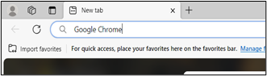

# Welcome!

I'm Emma, a technical writer, creative writer, and editor. I've been writing technical documentation for a variety of industries since 2012, focusing on product documentation. Because I enjoy learning, adding new skills to my repetoire, and gaining new experiences, I am now delving into the world of developer and API documentation.

## Portfolio

On this site you will find samples of my work from throughout my career, including the link to a website I created in 2017 and still maintain, as well as my resume.

I can work with multiple programming languages including HTML, Java, and JavaScript, and, more recently, Python.

## About Me

I have a Bachelor's of Science in Computer Science: Information Systems, minors in Business Administration, Professional Writing, and Creative Writing from Mansfield University.

Besides writing technical documentation, I also enjoy designing and building databases and websites.

I have a passion for learning about history, languages, and cultures. While my native language is English, I can also speak conversational Spanish, use basic American Sign Language, and know at least a couple of words in a dozen other languages.

I worked as a journalist for a local newspaper and MU's student newspaper, becoming the Editor-in-Chief of the student newspaper my senior year.

## Sample 1
**Background:** For an assessment during a job interview process, I was asked to complete a set of formatting, editing, and writing tasks. The writing task had three prompts to choose from and I was required to pick two of them. One prompt involved explaining how to download and set Google Chrome as the default browser for an elderly relative, Great Aunt Gertrude, who only uses Microsoft Edge.

I chose a conversational tone given the target audience, but scaled the screenshots to typical instruction sizes, although larger screenshots might be preferable for elderly users. If I were writing these instructions for a wider audience, I would have to consider the challenge of potential variations in users' computer setups, as it could impact the clarity of instructions.

**Chrome Installation Instructions:**

1.	Open a new Microsoft Edge window.

1.	In the search bar at the top, type **Google Chrome**, then press **Enter** on your keyboard.

 
1.	Click **Download Now**.
 
1.	A new page opens. Click the **Download Chrome** button.
  
1.	The download begins automatically. If it doesn’t, click **download Chrome manually**. 
 
1.	Once the download is complete, the file shows up under the **Downloads** button at the top right of the page. Click the button to show the downloaded file.
 
    Then, click **Open file**.

1.	Your computer will ask if you want to allow changes to be made to your computer. Select **Yes**. 
 
1.	Once the installation is complete a Google Chrome page opens automatically with the option to set Chrome as your default browser.
   
    After you click that button, you’ll get a message congratulating you on setting it as your default browser but there is nothing else you need to do. 

If you *don’t* get an option to set Chrome as your default browser, you can use the steps below to set it yourself:

1.	Open the computer’s **Start** menu.

1.	Click **Settings** or the **gear icon** to open the Settings menu.
  
1.	Click **Apps** to open the Application Settings menu.
  
1.	On the left-hand side of the page, click **Default Apps**.
 
    This opens the page to set your default application for several programs on your computer.

1. Scroll down to find **Web Browser**.
 
1.	Click the box to show all default browser options.
  
1.	Select **Google Chrome**. The menu closes and the change is automatically reflected on your list of default applications:
  
    You can close your settings menu using the **X** at the top right of the screen and you’re all set!

